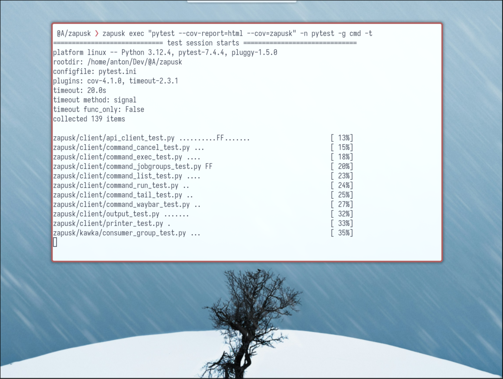

# Zapusk



Zapusk is a job runner for desktop environments. It helps you manage background tasks with features like pre-configured job execution, background shell commands, scheduling with cron-like syntax, log tailing, and notifications. It also provides detailed JSON output for easy data manipulation and analysis.

## Key Features

- **Preconfigured Jobs:** Run jobs defined in your configuration files.
- **Background Command Execution:** Run shell commands in the background with optional log tailing.
- **Cron-like Scheduling:** Schedule tasks using flexible cron syntax.
- **Log Tailing:** View logs in real-time.
- **Job Management:** Cancel running jobs and check their statuses.
- **Job Groups:** Share settings like callbacks and parallelism between jobs.
- **Colored JSON Output:** Easily readable JSON output.
- **Waybar Integration:** Display job statuses and notifications on Waybar.

## Installation

Install Zapusk using `pip`:

```sh
pip install zapusk
```

## Usage

Zapusk offers a command-line interface for managing and executing jobs. Here's a quick reference:

```sh
Usage:
  zapusk -h | --help
  zapusk --version
  zapusk run <job_config_id> [--colors|--no-colors] [--tail]
  zapusk exec <command> [--name=<name>] [--group=<group>] [--tail] [--schedule=<cron_expression>] [--colors|--no-colors]
  zapusk cancel <job_id> [--scheduled] [--colors|--no-colors]
  zapusk tail <job_id>
  zapusk list [--filter=<state>|--scheduled] [--colors|--no-colors]
  zapusk config_jobs [--colors|--no-colors]
  zapusk config_groups [--colors|--no-colors]
  zapusk waybar

Options:
  -h --help                     Show this screen.
  --version                     Show version.
  --colors                      Enable colors.
  --no-colors                   Disable colors.
  --filter=<state>              Filter jobs by status.
  -n --name=<name>              Name for a command.
  -g --group=<group>            Job group to run the command in.
  -t --tail                     Tail logfile immediately.

Examples:

    # Run npm install in the background
    zapusk exec "npm i"

    # Run pytest and tail its log
    zapusk exec "pytest -v" -t

    # Schedule a command to run every minute
    zapusk exec "ping -c4 google.com" --schedule "*/1 * * * *"

    # Run a job defined in ~/.config/zapusk/config.yaml
    zapusk run youtube_dl

    # Cancel a job by its ID
    zapusk cancel 42

    # See logs for a job by its ID
    zapusk tail 42
```

## Example Configuration

Here is an example configuration file for Zapusk. It defines job groups and individual jobs, specifying commands, schedules, and notifications.

```yaml
# Port server starts on and client call to
port: 9876

# Enable colored JSON output
colors: True

job_groups:
  - id: unsplash
    parallel: 1
  - id: sleep
    parallel: 2
  - id: cmd
    parallel: 10
    on_finish: notify-send -a "zapusk" "Command Finished" "{job.name} has finished" --icon kitty
    on_fail: notify-send -a "zapusk" "Command Failed" "{job.name} has failed" --icon kitty
  - id: cronie
    parallel: 1
    on_finish: notify-send -a "zapusk" "Scheduled Job Finished" "{job.name} has finished" --icon kitty
    on_fail: notify-send -a "zapusk" "Scheduled Job Failed" "{job.name} has failed" --icon kitty

jobs:
  - name: Unsplash Download
    id: unsplash
    args_command: "zenity --entry --text 'Collection ID'"
    command: ~/.bin/jobs/unsplash_dl.sh

  - name: Sleep
    id: sleep
    group: sleep
    args_command: "zenity --entry --text 'Sleep Time'"
    command: sleep
    on_finish: notify-send -a "zapusk" "Job Finished" "{job.name} has finished" --icon kitty
    on_fail: notify-send -a "zapusk" "Job Failed" "{job.name} has failed" --icon kitty

  - name: Cronie
    id: cronie
    group: cronie
    schedule: "*/10 * * * *"
    command: sleep 2
```

## Advanced Usage

### Running Preconfigured Jobs

Run jobs defined in your configuration file using their `id`.

```yaml
# Job configuration in ~/.config/zapusk/config.yaml
jobs:
  - name: Unsplash Download
    id: unsplash
    args_command: "zenity --entry --text 'Collection ID'"
    command: ~/.bin/jobs/unsplash_wallpaper_collection_download.sh
    on_finish: notify-send -a "Zapusk" "Wallpapers downloaded" --icon kitty
    on_fail: notify-send -a "Zapusk" "Wallpaper download failed" --icon kitty
```

```sh
# Run the `unsplash` job:
zapusk run unsplash
```

### Background Command Execution

Run commands in the background with optional log tailing:

```sh
zapusk exec "npm i" -t
```

### Scheduling Commands

Schedule commands to run at specific intervals using cron syntax:

```sh
zapusk exec "ping -c4 google.com" --schedule "*/1 * * * *"
```

Pre-configured jobs can also be scheduled:

```yaml
jobs:
  - name: Cronie
    id: cronie
    group: cronie
    schedule: "*/10 * * * *"
    command: sleep 2
```

### Managing Jobs

Cancel a running or scheduled job by its ID:

```sh
zapusk cancel 42
```

Tail the logs of a running job by its ID:

```sh
zapusk tail 42
```

List all pending, running, and finished jobs:

```sh
zapusk list
```

### Callbacks

Use `on_finish` and `on_fail` callbacks for notifications.

For job group callbacks:

```yaml
job_groups:
  - id: my_group
    parallel: 10
    on_finish: notify-send -a "zapusk" "Command Finished" "{job.name} has finished" --icon kitty
    on_fail: notify-send -a "zapusk" "Command Failed" "{job.name} has failed" --icon kitty
```

For individual job callbacks:

```yaml
jobs:
  - name: Sleep
    id: sleep
    group: sleep
    command: ~/.bin/jobs/sleep
    on_finish: notify-send -a "zapusk" "Job Finished" "{job.name} has finished" --icon kitty
    on_fail: notify-send -a "zapusk" "Job Failed" "{job.name} has failed" --icon kitty
```

### Waybar Integration

Zapusk integrates with Waybar to display job statuses and notifications directly on your desktop.

```json
// Example integration with wofi and jq
"custom/zapusk": {
  "exec": "zapusk waybar",
  "on-click": "zapusk config_jobs --no-colors | jq -r \".[].id\" | wofi --dmenu | xargs -I{} zapusk run {}",
  "tooltip": true,
  "return-type": "json",
  "format": "{}",
  "interval": 1
}
```

## Contribution

We welcome contributions! If you find a bug or have an idea for improvement, please open an issue or submit a pull request on our GitHub repository.

## License

Zapusk is licensed under the MIT License. See the [LICENSE](LICENSE) file for more information.
